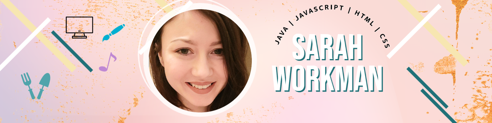

<!--
**Sarah-Workman/Sarah-Workman** is a ✨ _special_ ✨ repository because its `README.md` (this file) appears on your GitHub profile.

Here are some ideas to get you started:

- 🔭 I’m currently working on ...
- 🌱 I’m currently learning ...
- 👯 I’m looking to collaborate on ...
- 🤔 I’m looking for help with ...
- 💬 Ask me about ...
- 📫 How to reach me: ...
- 😄 Pronouns: ...
- ⚡ Fun fact: ...
-->

<h3> Connect with me 
<h3>

<H1> 🌱 I'm currently pursuing a BS in application development. 🌱 </h1>
 

 I have worked with java, javascript, html, and css. I'm currently learning more about javascript and hope to move on to reactjs soon.   

